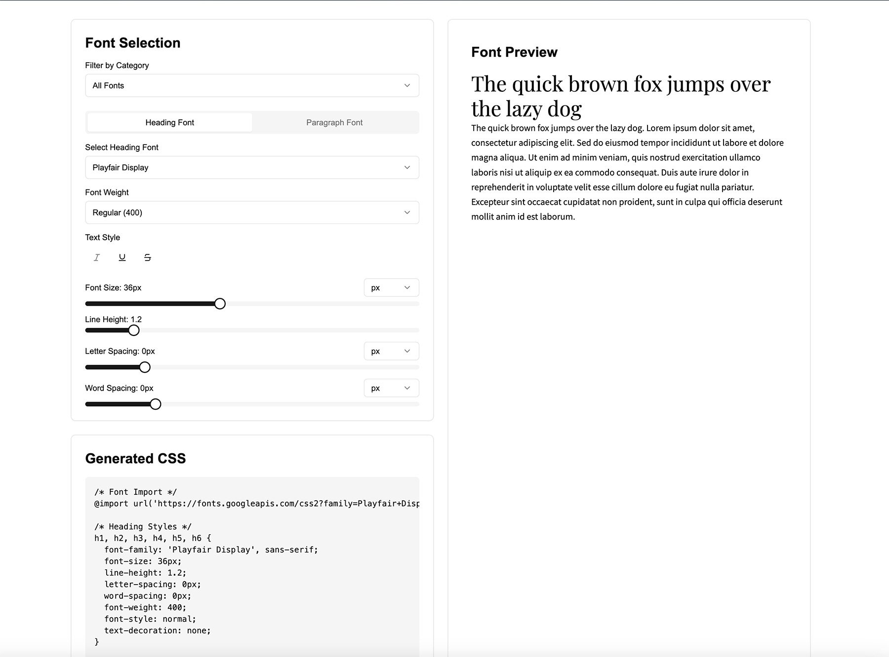

# fonts.defeo.io — Google Font Pairing Tool

An easy way to pair up and preview Google fonts!

**Live site**: [fonts.defeo.io](https://fonts.defeo.io)  
**Repo**: [github.com/mdefeo/fonts.defeo.io](https://github.com/mdefeo/fonts.defeo.io)



---

## Features


- One-click CSS copy

---

## Getting Started

### 1. Clone the repository

```bash
git clone https://github.com/mdefeo/fonts.defeo.io.git
cd fonts.defeo.io
```

### 2. Install dependencies

```bash
pnpm install
```

Or use npm install or yarn install if preferred.

### 3. Run locally

```bash
pnpm dev
```

Open [http://localhost:3000](http://localhost:3000) in your browser to see the app.

### Built With

- Next.js
- Tailwind CSS
- TypeScript
- Lucide Icons

### Design Goals & Inspiration


### Deployment

This project is automatically deployed to Vercel.

Visit [http://localhost:3000](http://localhost:3000) to view it in the browser.

### License

[MIT](./LICENSE)

### Author

Marcello De Feo
[defeo.io](https://defeo.io/)
